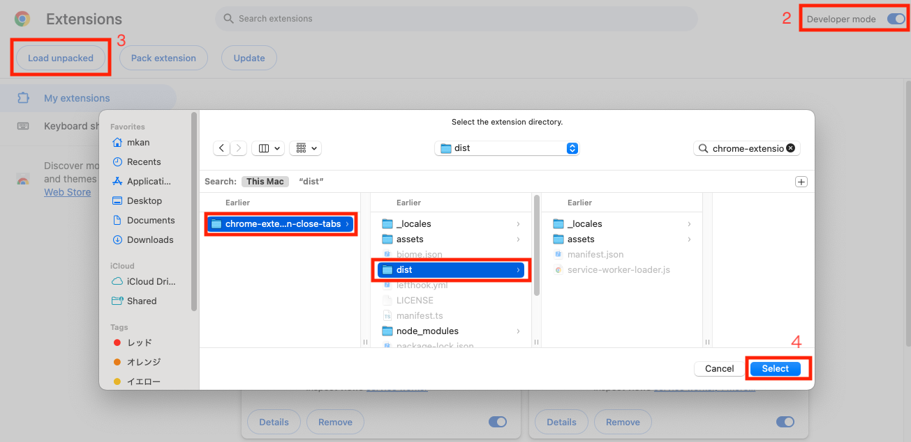

<div align="center">
  
  <h3>Close Tabs - Chrome Extension</h3>
</div>

# chrome-extension-close-tabs

Chrome extension for closing tabs in your browser.   
This is an alternative tool for [Close Tabs](https://chromewebstore.google.com/detail/close-tabs/gadafnnkijfmbbmeielphlapddbmgbgo?hl=ja).

## Development

### Setup

```bash
# package install
$ npm ci
# setup lefthook (Git hooks manager)
$ npx lefthook install
# run dev server
$ npm run dev
```

### Chrome extension setting

1. go to `chrome://extensions`
2. enable development mode
3. click `Load unpacked`
4. select `chrome-extension-close-tabs/dist` directory

Please refer to the image below for steps 2 to 4.



## License

[MIT](LICENSE).
